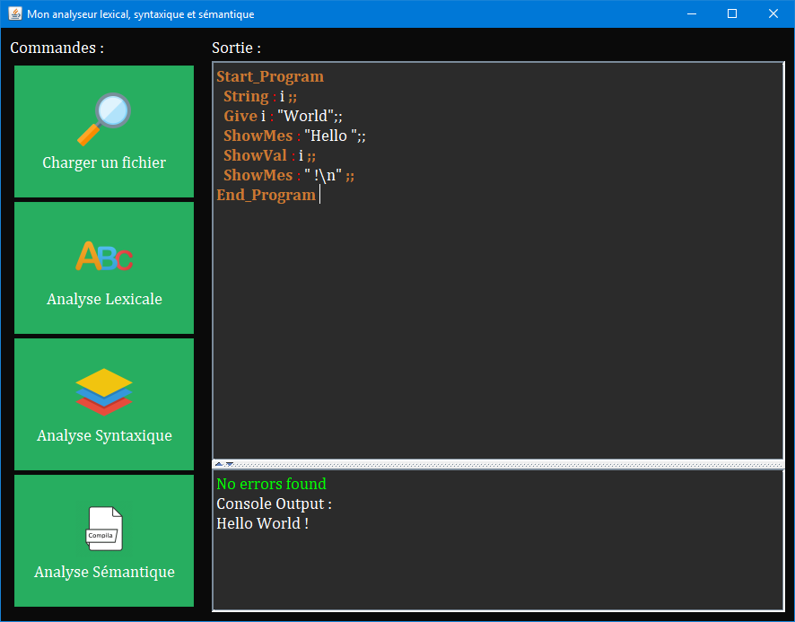

# CompilaCompiler
A basic compiler for a theorical programming langage named Compila

## Preview

## Langage specifications 
- One and only one instruction per line
- Program always starts with "Strart_Program" and ends with "End_Program"
- A comment can only be contained in one line, and must start with "//."
- An instruction always ends with two semi-colons ";;"
- A string is, like C-langage, put between two quotes, *but* contains only letters, digits or an apostrophe, it is declared with the keyword "String".
- Regular expressions corresponding to variables types of this langage are : 

Type | Description | Regex 
-----| ------------| ---------
Identifier | Must start with an uppercase followed by at least one alphanum character | `{letter}(_?({letter}\|{digit})+)*` 
Integer number | Composed of at least one digit  |  `[0-9]+`
Real number | Composed of at two integers separated by a point "." |  `[0-9]+\.[0-9]+`

- This langages also accepts the following commands : 

Command | Description | Example 
------- | ----------- | ---------------
Affectation of a number (Integer/Real) to a variable | Give <<identifier>> : <<value>> ;; | `Give j : 55 ;;`
Affectation of the value of a variable to another variable | Affect <<identifier>> to <<identifier>> ;; | `Affect i to j ;;`
Condition | If -- \<\<condition\>\> -- \<\<action\>\> ;; | `if -- i<j -- Give j : 55 ;;`

## Code example
`Start_Program`  
  `String` : i ;;  
  `Give` i : "World";;  
  `ShowMes` : "Hello ";;  
  `ShowVal` : i ;;  
  `ShowMes` : " !\n" ;;  
`End_Program`  
