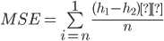

## IRDM Simple Image Indexer

## But du TP
Implémenter un système de recherche d'images en fonction de deux caractéristiques:


*   Couleur: où la recherche se fera par comparaison d’histogrammes de couleurs.
*   Texture: en calculant les matrices de co-occurrences (sera vu dans la 2ème partie).

Le résultat sera une liste d’image triées de la plus semblable à la moins, en calculant la distance entre les images de la base et l’image requête.

## Project Setup : 
- Importer le projet dans un IDE (IntelliJ, Netbeans..).
- Ajouter les *.jar du dossier lib comme librairies au projet.
- Run.
- Dans le version courante, Ajouter uniquement des images dans le dossier img du projet (ou accessibles par chemin relatif). 

## Indexation par couleur


### Réduction d’histogramme

Pour calculer l’histogramme de couleur, nous aurons à calculer trois histogrammes (un sur chaque couleur) avec 256 valeurs pour chacun. La réduction se fera en compressant l’histogramme à seulement M valeurs ( on choisit la M = 32 dans cet exemple), en regroupant chaque M valeurs de l’histogramme en une seule.

Enfin, nous appliquons une concaténation les 3 histogrammes pour obtenir un seul vecteur de 3*M valeurs représentant le descripteur couleur de l’image à indexer.


### Intersection de deux histogrammes

Nous utiliserons les quatres formules suivantes pour calculer la distance entre les deux histogrammes:


*   Swain et Ballard 1991:   

```java
    double sum = 0;
    double sumMin = 0;
    for (int i = 0; i < histogram.length && i < histogram2.length; i++) {
        sumMin += Math.min(histogram[i], histogram2[i]);
        sum += histogram[i];
    }
    return (sumMin / sum);
```

*   Smith et Chang 1996:  

```java
double sum = 0;
double sum2 = 0;
double sumMin = 0;
for (int i = 0; i < histogram.length && i < histogram2.length; i++) {
    sumMin += Math.min(histogram[i], histogram2[i]);
    sum += histogram[i];
    sum2 += histogram2[i];
}
return (sumMin / Math.min(sum, sum2));
```

*   Puzicha et al. 1997:  

```java
   double sum = 0;
   
   for (int i = 0; i < histogram.length && i < histogram2.length; i++) {
       double h1 = histogram[i] == 0 ? 0.00001 : histogram[i];
       double h2 = histogram2[i] == 0 ? 0.00001 : histogram2[i];
       sum += h1 * Math.log((2 * h1) / (h1 + h2)) + h2 * Math.log((2 * h2) / (h1 + h2));
   }

   return (sum);
```

*   Erreur quadratique moyenne: 


```java
   double sum = 0;
   int[] histogram2 = ((ColorDescriptor) o2).histogram;
   for (int i = 0; i < histogram.length && i < histogram2.length; i++) {
       sum += Math.abs(histogram[i] - histogram2[i]);
   }
   return sum / histogram.length;
```

h1: l’histogramme réduit de l’image requête.  
h2: l’histogramme réduit de l’image courante.

Résultat: la distance entre les couleurs des deux images.

##
## Indexation par texture

### Conversion de l’image en niveaux de gris

Pour simplifier la tâche, nous avons calculé les textures sur l’image uniquement en niveau de gris, en utilisant la fonction ci-dessous:


```java
double[][] grays = new double[n][m];

for (int i = 0; i < n; i++) {
    for (int j = 0; j < m; j++) {
        Color c = new Color(image.getRGB(j, i));    // x is j , y is i
        grays[i][j] = (c.getRed() * 0.299 + c.getGreen() * 0.587 + c.getBlue() * 0.114) * T / 255;
    }
}
```

### Réduction des niveaux de gris de l’image
Il est également inutile de conserver tous les niveaux de gris dans notre calcul de texture.  
Nous avons réduit la quantification de l’image pour la faire passer de 256 à T.  
Nous réalisons ceci de la même manière que la réduction de l’histogramme de couleur, en multipliant le niveau de gris par T/255 et ainsi avoir une valeur entre 0 et T.  
Dans notre cas T = 32.

### Calcul des matrices de co-occurrences

Pour chaque image quatres matrices de co-occurrences ont été calculées sur les images en niveaux de gris pour une distance  = 1 et pour les quatres directions: 0°, 45°, 90° et 135°.  
Exemple pour la matrice de 0° : 

```Java
public double[][] cMatrix0(double[][] grays) {
    double[][] cMat = new double[T][T];
    for (int i = 0; i < cMat.length; i++) {
        Arrays.fill(cMat[i], 0);
    }

    for (int i = 0; i < grays.length; i++) {
        for (int j = 0; j < grays[0].length - 1; j++) {
            int x = (int) grays[i][j];
            int y = (int) grays[i][j + 1];
            cMat[x][y]++;
        }
    }

    return cMat;
}
```
### Calculs des paramètres sur les matrices de co-occurrences

Pour notre cas, nous avons choisi que quatres paramètres parmis 14 possibles sur les matrices de co-occurrences, qui sont: l’énergie, l’entropie, l’inertie et le moment différentiel inverse.  
Pour chaque matrices quatres valeurs ont été calculés, avec en total 16 valeurs.  
Ensuite, ces valeurs ont été réduites en faisant la moyenne pour chaque paramètres.  
En résultat, 4 valeurs ont été conservées.

#### 1 Energie
   
```java
public static double energie(double[][] grays) {
    double sum = 0;
    for (int i = 0; i < grays.length; i++) {
        for (int j = 0; j < grays.length; j++) {
            sum += grays[i][j] * grays[i][j];
        }
    }
    return sum;
}
```
#### 2 Inertie
   
```java
public static double inertie(double[][] grays) {
    double sum = 0;

    for (int j = 0; j < T; j++) {
        for (int i = 0; i < T; i++) {
            sum += (i - j) * (i - j) * grays[i][j];
        }
    }
    return sum;
}
```
#### 3 Entropie   
   
```java
public static double entropie(double[][] grays) {
    double sum = 0;
    for (int i = 0; i < T; i++) {
        for (int j = 0; j < T; j++) {
            double p = grays[i][j] == 0? 0.00001 : grays[i][j];
            sum += grays[i][j] * Math.log(p);
        }
    }
    return -1 * sum;
}
```
#### 4 Moment differentiel inverse
   
```java
public static double mdi(double[][] grays) {
    double sum = 0;
    for (int i = 0; i < T; i++) {
        for (int j = 0; j < T; j++) {
            double p = grays[i][j] == 0? 0.00001 : grays[i][j];
            sum += 1 / ((1 + (i - j) * (i - j)) * p);
        }
    }
    return sum;
}
```

### Calcul de la distance entre les textures de deux images différentes

Pour calculer la distance entre les texture pour deux images, nous avons utilisé la formule suivante:


parametre: un paramètre parmis les quatres paramètres déjà cités.  
parametre1: le paramètre calculé sur l’image requête.  
Parametre2:  le paramètre calculé sur l’image courante.  
Résultat: distance.

En dernière étape, nous avons calculé la moyenne de ces quatres distances, en utilisant la formule suivante:


```java
public double distance(Descriptor o2) {
    TextureDescriptor o = (TextureDescriptor) o2;

    return (
            paramsDistance(this.energy, o.energy)
            + paramsDistance(this.inertia, o.inertia)
            + paramsDistance(this.entropie, o.entropie)
            + paramsDistance(this.moment, o.moment)
            ) / 4;
}
```

## Indexation par texture

Nous pouvons combiner les deux distances précédemment calculées, en appliquant la formule suivante : 

`distance = poids * dist(couleur) + (1-poids) * dist(texture)`

```java
public double distance(Descriptor o2) {
    CompoundDescriptor o = (CompoundDescriptor) o2;

    double colorDist = this.colorDescriptor.distance(o.colorDescriptor);
    double textureDist = this.textureDescriptor.distance(o.textureDescriptor);

    return COLOR_WEIGHT * colorDist + TEXTURE_WEIGHT * textureDist;
}
```

## Implémentation

Nous avons choisi:

*   Intellij IDEA comme IDE.
*   Java Swing comme bibliothèque graphique pour l’interface.
*   SQLite comme moteur de base de données.

L'utilisateur peut ainsi faire les actions suivantes :
*   Ajouter des images à la base d’images.
*   Voir les descripteurs d’une image.
*   Charger une image sur laquelle il veut faire une recherche.
*   Choisir le critère de recherche (couleur/texture).
*   Supprimer des images de la base.

Après avoir ajouter des images à la base, charger l’image requête et choisit le critère de recherche, le système de recherche affichera les premières 6 images indexées de la plus ressemblante à la moins. 

Pour avoir plus d’informations sur les caractéristiques de chaque image résultat, il suffira de cliquer sur l’image voulue. 


## Diagrammes de classe


## Description de classe

Le projet est divisé en 4 grands packages : 

1.   **UI** : 
    *   Contient les différentes classes de l’interface graphique.  
    
2.  **Descriptors**: Contient les objets englobant les descripteurs: 
    *   **ColorDescriptor**: Le descripteur couleur est considéré comme un simple vecteur de taille 3*M, contenant les valeurs de l’histogramme calculé.
    *   **TextureDescriptor**: Le descripteur texture ne garde que les 4 valeurs calculées (energie, inertie, entropie, moment differentiel inverse).
    *   **CompoundDescriptor**: Une classe encapsulant les deux descripteurs de Couleur et Texture, permet de calculer une distance en combinant les deux.  
3.  **Indexers :** Contient les différentes classes pour contenir les images indexés et calculer leur descripteurs :
    *   **IndexedImage**: Contient l’image, son chemin et ses descripteur.
    *   **ColorIndexer**: Calcul les descripteurs d’images, utilise les différents algorithmes cités dans la section précédente selon le paramètre donné.
    *   **TextureIndexer**: Calcul les descripteurs texture de l’image suivant les étapes cités précédemment, et retourne un TextureDescriptor.
    *   **CompountIndexer**: Permet de lancer une recherche d’image utilisant les deux autres classes (Texture et Couleur).  
4.  **Main**: Contient la classe principale et différents managers pour la lecture de fichiers et gestion de la base de données.

## Captures d’écran

Remarque : L’interface changera au fil de l’avancement du projet.


**Échantillon de la base d’images utilisée.**


**Interface du menu principal**


**Sélection du fichier à importer**


**Affichage de l’image importée et son histogramme de couleurs**


**Affichage de Résultat de comparaison avec les images de la base.**

## 
#### Contibutors :
- ABDERRAHIM Oussama.
- BENHADJ AMAR  Aya Ichrak. 